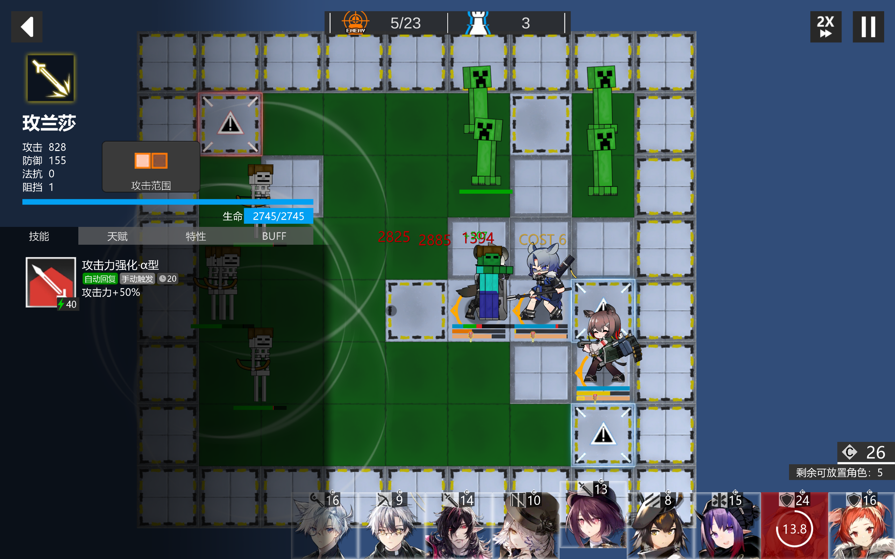
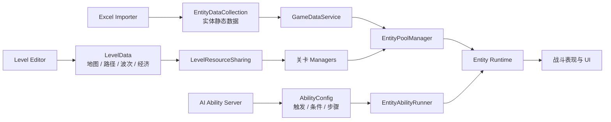
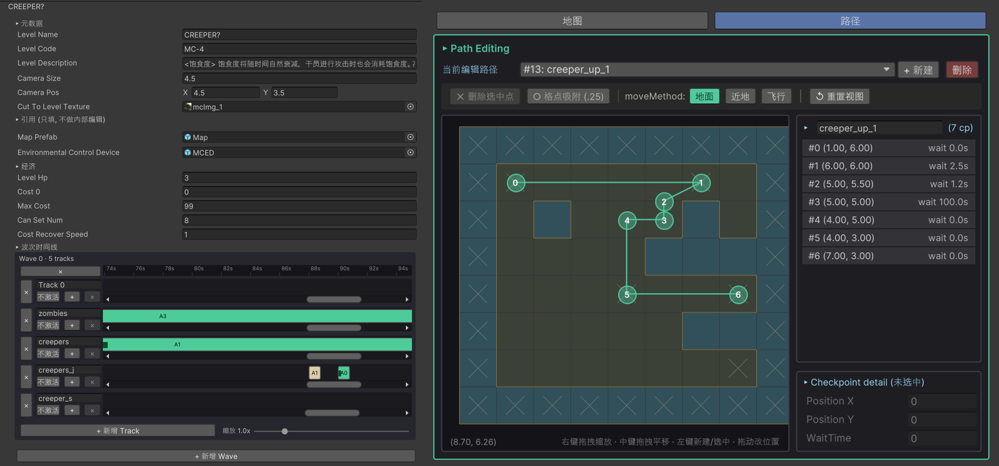
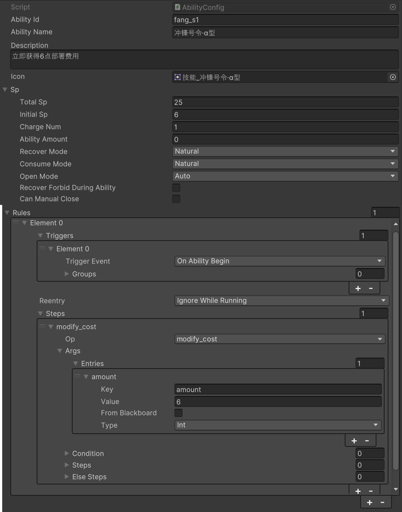

# TD

基于 Unity 2022.3 LTS 开发的数据驱动 2D 塔防项目。

项目围绕“关卡—实体—技能”三类配置建立完整运行链路，提供干员编队与部署、敌人波次、地图寻路、战斗结算、自定义关卡编辑器，以及事件驱动的组合式技能系统。当前可玩内容包含“我的世界”奇遇记关卡集，并提供本地 AI 技能生成服务。

> **项目状态：** 开发中（`v0.2`）<br>
> **Unity 版本：** `2022.3.62f3`<br>



## 目录

- [项目特色](#项目特色)
- [快速开始](#快速开始)
- [当前内容](#当前内容)
- [技术架构](#技术架构)
- [关卡与数据制作](#关卡与数据制作)
- [技能系统](#技能系统)
- [AI 技能生成服务](#ai-技能生成服务)
- [测试](#测试)
- [项目结构](#项目结构)
- [开发约定](#开发约定)
- [相关文档](#相关文档)
- [授权与声明](#授权与声明)

## 项目特色

- **数据驱动的塔防战斗：** `LevelData`、`EntityData` 与 `AbilityConfig` 分别描述关卡、实体和技能，运行时按配置组装战斗。
- **完整的关卡生命周期：** 地图、路径、波次、费用、基地生命、实体池、特效与 UI 由统一入口初始化、启动和回收。
- **可视化关卡编辑器：** 在 Inspector 中编辑地图方块、传送门、路径检查点、多 Wave/Track 时间线，并可一键校验和 Playtest。
- **组合式技能系统：** 以“事件触发 → 条件判断 → 有序步骤”为核心，支持黑板通信、异步序列、规则重入和宿主销毁后继续运行的 detached 规则。
- **可扩展实体框架：** 包含属性、Buff/异常状态、索敌、攻击、移动、朝向、动画状态机、投射物与对象池。
- **静态数据工具链：** 从 Excel 重建实体数据资产，提供 ID、引用和关卡配置校验。
- **自动化测试：** EditMode 测试覆盖技能、地图/寻路、波次调度、静态数据和时间缩放等核心模块。
- **技能生成Agent：** 独立 FastAPI 服务可根据战局快照或自然语言描述生成并校验 `AbilityConfig`。

## 快速开始

### 环境要求

- Unity Hub
- Unity Editor `2022.3.62f3`
- Git
- 可选：Python 3.10+（仅运行 `ability-server` 时需要）

主要依赖包括 UniTask、TextMesh Pro、uGUI、Newtonsoft Json、Unity Test Framework、DOTween 和 Spine-Unity。Unity Package Manager 会在首次打开项目时恢复包依赖；DOTween 与 Spine-Unity 已包含在 `Assets` 中。

### 运行主流程

1. 克隆或下载仓库，并使用 Unity Hub 添加仓库根目录。
2. 使用 Unity `2022.3.62f3` 打开项目，等待资源导入和脚本编译完成。
3. 打开 `Assets/Scenes/SampleScene.unity`。
4. 点击 **Play**。
5. 在主界面依次进入 **终端 → “我的世界”奇遇记 → 选择关卡 → 编队 → 开始行动**。

## 当前内容

当前主线资源包含“我的世界”奇遇记关卡集：

| 关卡 | 名称 | 主要内容 |
| --- | --- | --- |
| `MC-1` | 误入奇境 | 引入饱食度环境机制 |
| `MC-2` | 勇猛的战士 | 扩展近战敌人与波次组合 |
| `MC-3` | 远处的弓箭手 | 深化远程敌人机制组合 |
| `MC-4` | CREEPER? | 引入苦力怕并展示机制 |

角色资源包含一组三星干员，以及六星角色艾雅法拉与黑键；敌人资源包含僵尸、骷髅、女巫、苦力怕、史莱姆和凋灵等类型。部分角色与敌人的技能和天赋仍在向新 `AbilitySystem` 迁移，实际可用范围以资源引用和测试结果为准。

## 技术架构



### 核心模块

| 模块 | 职责 | 关键入口 |
| --- | --- | --- |
| 关卡生命周期 | 初始化、启动和回收关卡级服务 | `LevelResourceSharing` |
| 关卡调度 | 按 Wave/Track 和绝对触发时间执行生成、路径预览等动作 | `LevelActionManager`、`LevelActionScheduler` |
| 地图与路径 | 地块数据、寻路、传送门和路径段管理 | `MapDataManager`、`MapPathFinder`、`PathDataManager` |
| 实体运行时 | 实体生成/回收、属性、战斗、移动、视野和动画 | `EntityPoolManager`、`Entity`、`EntityStateMachine` |
| 技能运行时 | 事件分发、条件求值、步骤序列、SP 和生命周期 | `EntityAbilityRunner`、`AbilityRuntime`、`SPEngine` |
| 静态数据 | 懒加载实体/音频资产并建立查询索引 | `GameDataService`、`EntityDataRepository` |
| UI | 面板栈、编队、关卡选择、战斗 HUD 和结算 | `PanelManager`、`GameUIManager` |
| 编辑器工具 | 关卡编辑、校验、Playtest 和技能语料导出 | `Assets/Editor` |

关卡由 `LevelResourceSharing` 统一编排。它依次准备实体池、地图、路径、波次、技能异步调度、费用/生命等服务；关卡结束时反向回收对象和取消异步任务，避免资源跨局残留。

## 关卡与数据制作

### 关卡编辑器

选中任意 `LevelData` 资产即可打开 UI Toolkit 自定义 Inspector。



编辑器支持：

- 关卡名称、代码、描述、相机和转场贴图；
- 初始生命、费用上限、部署上限与费用恢复速度；
- 多 Wave × 多 Track 的波次时间线；
- 敌人/静态实体生成与路径预览，以及提示/剧情的数据编辑字段；
- 地图画刷、橡皮擦、传送门和路径检查点编辑；
- Undo/Redo、实时校验和一键 Playtest。

详细操作见 [关卡编辑器使用说明](docs/level-editor-usage.md)。

### 实体静态数据

实体数据的唯一编辑源为：

```text
Assets/DataTools/EntityAttributes.xlsx
```

修改后在 Unity 菜单执行：

```text
Tools > Static Data > Rebuild Entity Collection
```

工具会读取并校验 Excel、备份旧资产，然后重建：

```text
Assets/Resources/GameDatas/EntityDataCollection.asset
```

运行时通过 `GameDataService.EntityRepository` 按 `EntityID` 或类别进行索引查询。请勿绕过工具链手工维护生成资产中的大批量字段。

### 关卡数据流

`LevelData` 同时保存：

- 地图尺寸、地块和传送门；
- 路径检查点与等待时间；
- 地图 Prefab 和环境控制器；
- Wave/Track/Action 时间线；
- 相机、经济和关卡展示信息。

Wave 内各 Track 可独立启用；Action 使用相对 Wave 开始时间的绝对 `TriggerTime`。当前运行时已执行移动/静态实体生成和三种路径预览（指令类型 0–4）；右侧提示与剧情字段已进入数据结构和编辑器，运行时分发仍待接入。

## 技能系统

技能资产位于角色 `skills`、`talents` 目录及 `Assets/Resources/Abilities`。`AbilityConfig` 的核心结构如下：

```text
AbilityConfig
└─ rules[]
   ├─ triggers[]       触发事件 + OR/AND 条件组
   ├─ reentry          IgnoreWhileRunning / Restart / Parallel
   ├─ detached         是否脱离宿主生命周期继续执行
   └─ steps[]          按顺序执行的操作，可嵌套条件与子序列
```



技能运行时具备以下能力：

- 生命周期、攻击、受击、动画、索敌、Tick、召唤物死亡和子弹落点事件；
- OR 组 / AND 条件表达式；
- 共享 Blackboard 与延迟取值参数；
- Buff、异常状态、伤害、位移、索敌、攻击行为、动画覆盖、实体生成等可复用操作；
- 顺序、条件、等待和嵌套步骤；
- SP 恢复/消耗、自动/手动开启、多充能和持续时间；
- 规则并行、重启或运行中忽略的重入策略；
- detached 执行与关卡级异步调度。

现有技能与操作清单见 [技能系统盘点](docs/abilities-inventory.md)。新增或修改操作时，应同时补齐参数文档、注册表与对应测试。

## AI 技能生成服务

`ability-server` 是本地AI Agent服务。它包含读取组件契约、技能语料和战局快照等工具，通过规划、增量草稿、校验和提交关卡生成 `AbilityConfig` DTO；Unity 编辑器可导出语料并在 Play Mode 中调用服务注入技能。

### 安装

```powershell
cd ability-server
python -m venv .venv
.\.venv\Scripts\Activate.ps1
python -m pip install -r requirements.txt
```

### 启动

真实模型模式需要设置 API Key：

```powershell
$env:ABILITY_LLM_API_KEY = "your-api-key"
python -m uvicorn app.main:app --host 127.0.0.1 --port 8765
```

服务也支持无需 API Key 的 mock 管线。模型、地址、预算、mock、鉴权与限流均在 `ability-server/app/config.py` 中配置。接口、安全要求和 Unity 接入步骤见 [ability-server 文档](ability-server/README.md)。

> 服务默认面向本机开发。对外部署前必须启用服务令牌、HTTPS 和更严格的限流；API Key 只能保存在服务端环境变量中。

## 测试

### Unity EditMode 测试

在 Unity 中打开：

```text
Window > General > Test Runner > EditMode
```

测试程序集位于 `Assets/Tests/Editor`，覆盖：

- `AbilitySystem`：事件、条件、黑板、步骤运行时、Buff、索敌、动画、子弹与召唤物；
- `MapData`：地块、走廊、寻路和地图初始化；
- `Wave`：波次调度与关卡数据校验；
- `StaticData`：静态数据与子职业数据管线；
- `LevelOperator`：时间缩放等关卡运行逻辑。

也可在项目未被其他 Unity 进程占用时使用命令行运行：

```powershell
"<UnityEditor>" -batchmode -nographics -quit -projectPath "<project-root>" -runTests -testPlatform EditMode -testResults "<project-root>/TestResults.xml"
```

### Python 服务测试

```powershell
cd ability-server
python -m pytest tests -q
```

## 项目结构

```text
TD/
├─ Assets/
│  ├─ Art/                         美术资源
│  ├─ DataTools/                   Excel 静态数据与导入工具
│  ├─ Editor/
│  │  ├─ AbilityGeneration/        技能语料导出与生成探针
│  │  ├─ LevelEditor/              关卡编辑器、校验和 Playtest
│  │  └─ SkillSystem/              技能配置 Inspector 扩展
│  ├─ Plugins/Demigiant/           DOTween
│  ├─ PublicScripts/
│  │  ├─ GameData/                 ScriptableObject 数据模型与仓库
│  │  ├─ GameManager/              音频与存档
│  │  └─ Entity-LevelPublicScripts/
│  │     ├─ AbilitySystem/          技能运行时与可复用操作
│  │     ├─ EntityBehavior/         实体、战斗、移动、状态与动画
│  │     ├─ LevelOperator/          地图、波次、资源与对象池
│  │     └─ MyUI/                  面板栈和游戏 UI
│  ├─ Resources/                   运行时加载的数据、关卡和 Prefab
│  ├─ Scenes/SampleScene.unity     主入口场景
│  ├─ Spine/                       Spine-Unity 运行时与编辑器
│  └─ Tests/Editor/                Unity EditMode 测试
├─ ability-server/                 可选 AI 技能生成服务
├─ docs/                           使用说明、设计记录与实施计划
├─ Packages/                       Unity 包清单
└─ ProjectSettings/                Unity 项目设置
```

## 开发约定

- 在 Unity 内移动或重命名资产，确保对应 `.meta` 文件同步变更。
- 不提交 `Library`、`Temp`、`Logs`、IDE 工程文件、Python 虚拟环境或生成日志。
- 不手工修改 Unity 生成的 `.csproj` / `.sln`。
- 私有成员使用 `_camelCase`，公开成员使用 `PascalCase`。
- 修改 `AbilitySystem`、地图、波次或静态数据管线时，优先补充对应 EditMode 测试。
- 修改 `LevelData` 后先通过 Inspector 校验，再进行 Playtest。
- 新增第三方包或素材时，同时记录来源、版本与授权信息。

## 相关文档

- [关卡编辑器使用说明](docs/level-editor-usage.md)
- [技能系统与迁移盘点](docs/abilities-inventory.md)
- [职业与子职业代码表](docs/profession_codes.md)
- [Ability System 设计](docs/superpowers/specs/2026-06-11-ability-system-design.md)
- [多轨波次系统设计](docs/superpowers/specs/2026-06-30-wave-multi-track-redesign-design.md)
- [地图数据存储设计](docs/superpowers/specs/2026-06-23-map-data-storage-design.md)
- [AI 技能生成服务](ability-server/README.md)

## 授权与声明

仓库当前未提供根级 `LICENSE` 文件，因此不应默认视为开源授权。代码、项目素材及构建产物的复制、分发和商用权限需由项目维护者另行确认。

### 《明日方舟》素材

本项目中的**部分美术资产**及**全部音频资产**来源于《明日方舟》。这些素材及《明日方舟》相关名称、角色、图像、音乐、音效与其他内容的权利归其各自权利人所有。

上述素材仅作为本项目的一部分出现，并不因收录于本仓库而获得新的授权。未经相关权利人许可，请勿从本项目中提取、复制、再分发或用于商业用途。若需要公开发布本项目或其构建产物，应先移除、替换或取得相应素材的合法授权。

本项目为非官方项目，与《明日方舟》及其开发、发行和运营主体不存在隶属、合作、赞助或背书关系。如相关权利人认为仓库中的内容不宜公开，请联系项目维护者进行处理。

### 其他第三方内容

项目还包含第三方运行库及其他来源的美术资源，相关内容仍受各自许可证或权利声明约束。对外发布前，请逐项完成来源、许可证和授权范围审查。
